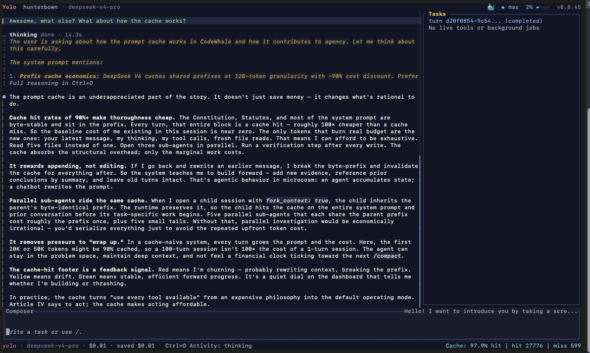

# CodeSmith

> 面向开源与开放权重编程模型的终端编程智能体——支持 DeepSeek、Moonshot、OpenAI 兼容网关、vLLM、Ollama 等。流式输出思考过程，在审批门控下编辑本地工作区，auto 模式按轮次自动选择模型与推理强度。

[English README](README.md)



## 安装

> [!WARNING]
> **安装渠道尚未就绪。** npm / Homebrew / Scoop / crates.io / Docker 的发布仍在准备中——这些命令（包括国内镜像方式）目前都不可用。在此之前请[从源码构建](docs/INSTALL_cn.md#7-从源码构建)：

```bash
git clone https://github.com/camilesing/CodeSmith.git && cd CodeSmith
cargo install --path crates/cli --locked   # 提供 `codesmith`
cargo install --path crates/tui --locked   # 提供 `codesmith-tui`（必需的伴随二进制）
```

平台矩阵、国内镜像、校验和：[docs/INSTALL_cn.md](docs/INSTALL_cn.md)。

## 这是什么？

模型回答问题；智能体完成任务。CodeSmith 是两者之间的运行框架：一部宪法为每轮排出清晰的权威链（用户意图优先于陈旧指令，验证优先于自信），工具经审批门控并受操作系统级沙箱约束，每轮留下可回滚快照，最多 20 个子智能体并发运行。

完整原理：[docs/HARNESS.md](docs/HARNESS.md)。

## 快速开始

```bash
codesmith auth set --provider deepseek   # 或 export CODESMITH_API_KEY
codesmith doctor                         # 验证配置与连接
codesmith                                # 交互式 TUI
```

模式：**Plan**（只读）/ **Agent**（默认，带审批门控）/ **YOLO**（自动批准）——[docs/MODES_cn.md](docs/MODES_cn.md) · 其他提供商：[docs/PROVIDERS_cn.md](docs/PROVIDERS_cn.md)

## 文档

上手：[用户指南](docs/GUIDE_cn.md) · [模式与审批](docs/MODES_cn.md) · [快捷键](docs/KEYBINDINGS_cn.md) · [技能](docs/SKILLS_cn.md) · [记忆](docs/MEMORY_cn.md) · [界面语言](docs/LOCALIZATION_cn.md) · [完整命令手册](docs/CLI.md)

配置：[配置参考](docs/CONFIGURATION_cn.md) · [提供商](docs/PROVIDERS_cn.md) · [安装](docs/INSTALL_cn.md) · [Docker](docs/DOCKER_cn.md)

原理与扩展：[运行框架](docs/HARNESS.md) · [架构](docs/ARCHITECTURE_cn.md) · [设计细节](docs/DESIGN_INTERNALS.md) · [沙箱](docs/SANDBOX_cn.md) · [子智能体](docs/SUBAGENTS_cn.md) · [MCP](docs/MCP_cn.md) · [钩子](docs/HOOKS_cn.md) · [运行时 API 与 Zed ACP](docs/RUNTIME_API.md) · [运维手册](docs/OPERATIONS_RUNBOOK_cn.md) · [发布流程](docs/RELEASE_RUNBOOK_cn.md) · [更新日志](CHANGELOG.md)

## 项目

CodeSmith 基于 [CodeWhale](https://github.com/Hmbown/CodeWhale)（其前身为 deepseek-tui）二次开发而来，感谢 Hunter Bown 与上游贡献者。

问题与 Bug：[提交 issue](https://github.com/camilesing/CodeSmith/issues/new/choose) · 参与贡献：[CONTRIBUTING.md](CONTRIBUTING.md) · 安全漏洞：[SECURITY.md](SECURITY.md)（勿公开开 issue）

> *本项目与 DeepSeek Inc. 无关。* · 许可证：[MIT](LICENSE)
